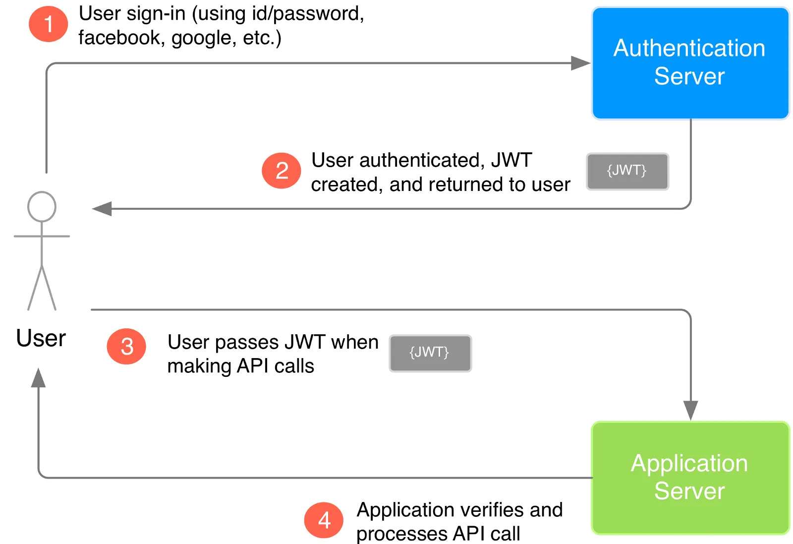

# Team 18's notes for Authorization.

## Sergio
- **Basic Auth** is an obvious choice for authorization. It is easy to implement and straight forward. It isn't as basic as storing data in plain text but it is definitely limited in security. This method utilizes Base64 encoding/decoding in the Header. 
  - Adding JWT to determine authorization would be a smart idea. This would handle admin granting access to admin pages once they are authenticated.

- **OAuth** relegates the authorization process to another site (i.e: Google, Facebook). There are many ***flows*** that Oath can use to perform authentication, such as granting short-lived code or an access token.
  - This would be a good stretch goal to implement as it is a part of the best practices to do.

It is also important to note with either decision we choose, our sponsor will use their company integration as the authentication. The lifetime of the authentication will only live as long as the project remains our capstone.

## Dillon

## Shane
Based on the requirements, I think Basic Auth is probably going to be sufficient.  We know we will have to make updates and do an integration with StateFarms internal AD for authentication if they go to onboard this app.  So burning through the additional cycles beyond basic auth is probably not required.  We can add a stretch goal to dig standup an LDAP server and integrate authentication with that to make the transition from Heroku to SF easier, but I do not think that should be a priority task.

## Adam
- **Basic Auth:**  Requires sign in with username/ID and password.
	- Typically takes the password and compares it to that which is stored in the authentication database.
	- This appears to be the most applicable approach for our project.

|   |   |   |   |
|---|---|---|---|
|PROS:   |Easy to manage in app   |Easy to deploy   |Easy for end users   | 
|CONS:   |Pws weakly specified   |IDs can be spoofed  |PWs susceptible to theft |

- **Multi-Factor Auth:** combination of auth to validate ID
	- Typically uses name and password, paired with some form of token
	  -  Token could be smart-card, one-time passphrase, single use PINS, biometric info

|   |   |   |   |   |
|---|---|---|---|---|
|PROS:  |Difficult to spoof   |Easy to use   |   |   |
|CONS:   |Deploy difficult   |Tokens easy to steal   |Mgmt of tokens challenging, esp if token is lost/stolen	 |

- **Cryptographic Auth:**  includes public key auth, digital signature, message auth code, password permutation
  -  This looks out of scope for what we are capable of doing, unless we use 3rd party auth service.

Link to article: https://www.developer.com/design/article.php/3600351/Authentication-in-Applications.htm

- **API Key:** This is a generated code given to the developer that is a long, unguessable string
  - Can pass alongside auth header:
    - curl "https://example.com/" \
    - -H "Authorization: 234092oasdfn320dafn3252304fd"

|   |   | 
|---|---|
|PROS:  |Add nuance to given keys: restricts some, gives access to others |
|CONS:   |No standard on API key like that of basic authentication (standards were est in 1999) |

- **OAuth:** Ensures end user shared no creds with third-party appl, ie, the developer.

|   |   |   | 
|---|---|---|
|PROS:  |Can handle sign in through common apps: github, fb, apple, twitter, google, microsoft, yahoo |promotes best practices|
|CONS:   |Tricky for new devs to impl |  No one-way of doing OAuth |

Link to article: https://dev.to/bearer/the-three-most-common-api-authentication-methods-2mnm

- **Firebase Auth:** 3rd party service that has open-source JS library for web auth solutions 

|   |   |   |
|---|---|---|
|PROS:  |Can handle sign in through common apps: github, fb, apple, twitter, google, microsoft, yahoo| promotes best practices |
|   |Has drop-in auth or manual SDK impl   |Has framework for web, mobile and Unity   |   |
|CONS:   |Exports service to Google for Auth|   |   |

## Chris
