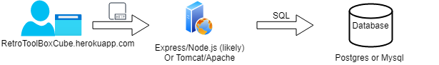

# Team 18's notes for Networking.

## Sergio
  -**AWS** would be a deployment platform for docker containers. This optionw ould require a lot of setup and configuration. It would mean we have a ton of flexibility. This comes in a free option for us to use for our capstone.
  
  -**Firebase** can handle authentication, storage, and the application program all with itself. It contains a wealth of options to analyze and grow the project. However, a big drawback is that it is very hard to migrate from it. This would mean that our sponsor would have a difficult time moving the capstone to their proprietary systems once the project is done.

  -**Heroku** is a likely the best choice for the ease of use straightforward nature. It is easy to migrate projects to and from heroku, and comes with a student option to use for the capstone. Heroku offers site hosting, with a drawback of the site required a "wake-up" period after inactivity.
   
- Heroku has limited plugin support compared to other options. For our capstone, they should be sufficient as it offers MySQL, Postgres, and MongoDB support.

## Dillon

## Shane
Network flow diagram updated.  Design needed to be able to scale.  Designed a forward looking architecture to accomodate a scaling design.  For the project we will implement a scaled down version, but having the design in place will ensure that we do not introduce any one way doors that would prevent this for succeeding as it scales.

A couple of other things to consider and make decisions on

    * Will we use IP or DNS to connec to the site?
    ** Probably need to use DNS because we are hosting in the cloud.  So we need to investigate if Heroku will provide a stable dynamic DNS name for us to use as the landing page.
    ***Update from heroku
        > By default, a Heroku app is available at its Heroku domain, which has the form [name of app].herokuapp.com. For example, an app named serene-example-4269 is hosted at serene-example-4269.herokuapp.com.> 

Network Connectivity Diagram Created and Updated

    

## Adam
- Potential network flow must be maintainable and scale.
   -  Heroku service for app hosting and database (Postgres, included, but can use other database if necessary).
      -  Heroku can scale app automatically as needed.  Can be adjusted in configuration of app service on website.  
         -  assuming we build it correctly.
   -  potential high-level design:
   

## Chris
