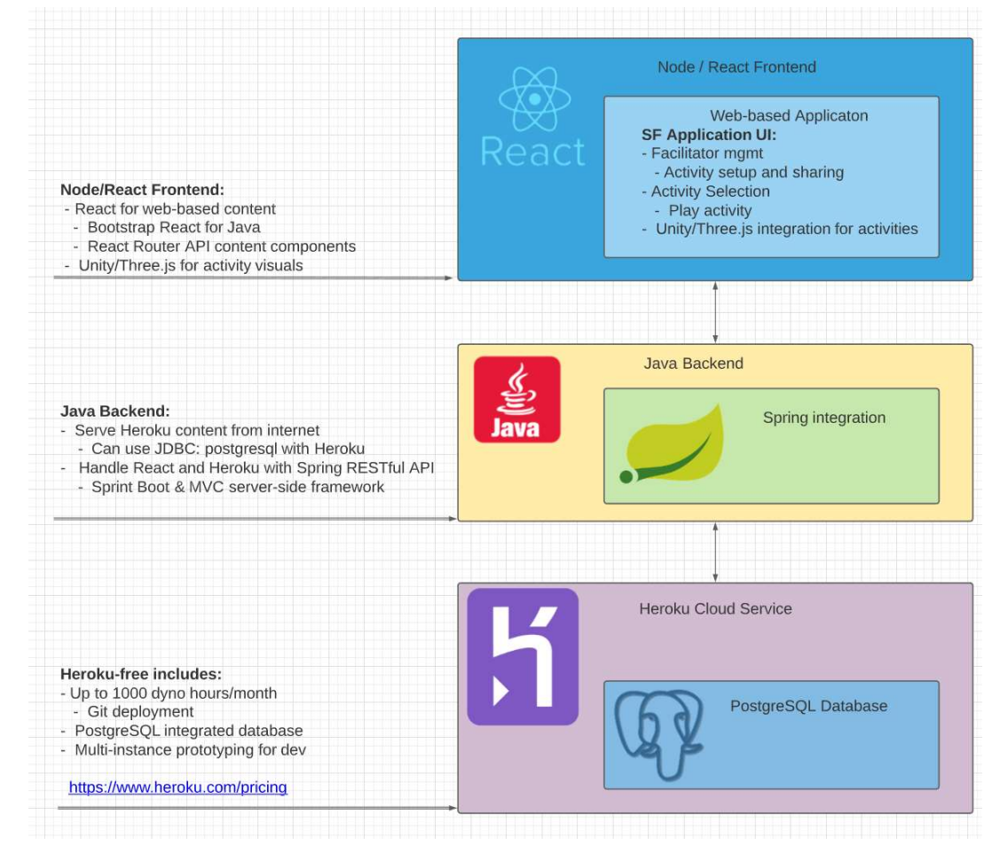

# Team 18's notes for Networking.

## Sergio
   - AWS

## Dillon

## Shane
Network flow diagram updated.  Design needed to be able to scale.  Designed a forward looking architecture to accomodate a scaling design.  For the project we will implement a scaled down version, but having the design in place will ensure that we do not introduce any one way doors that would prevent this for succeeding as it scales.

A couple of other things to consider and make decisions on

    * Will we use IP or DNS to connec to the site?
    ** Probably need to use DNS because we are hosting in the cloud.  So we need to investigate if Heroku will provide a stable dynamic DNS name for us to use as the landing page.
    ***Update from heroku
        > By default, a Heroku app is available at its Heroku domain, which has the form [name of app].herokuapp.com. For example, an app named serene-example-4269 is hosted at serene-example-4269.herokuapp.com.> 

Network Connectivity Diagram Created and Updated

    

## Adam
- Potential network flow must be maintainable and scale.
   -  Heroku service for app hosting and database (Postgres, included, but can use other database if necessary).
      -  Heroku can scale app automatically as needed.  Can be adjusted in configuration of app service on website.  
         -  assuming we build it correctly.
   -  potential high-level design:
   

## Chris
