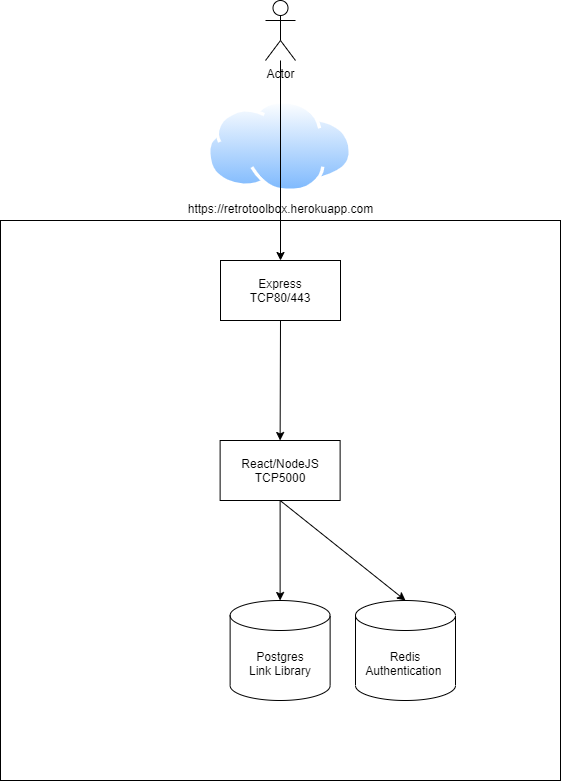

Architecture Discussion
The application is designed to be hosted in heroku. The front end will leverage express to serve up a javascript based page with the application layer logic happening from a node/react middleware platform. The backend will be a database.

The job of the express frontend is to act as a presentation mechanism and to handle connectivity between users and the application.

The middleware node/react stack function is to provide application logic, session management (maybe) and access database components. It will also handle controlling access to admin pages.

The backend or database layer will have two functions. The first is a Redis database to host login information for authentication of admin personnel. The second is a Postgres database to host links to the local images used to be placed on the dice.

[DrawIO File](resources/retrotoolbox_architecture.drawio)
