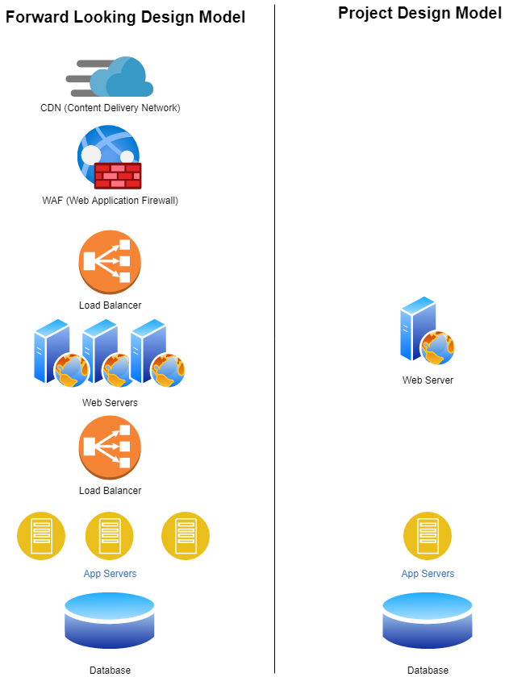
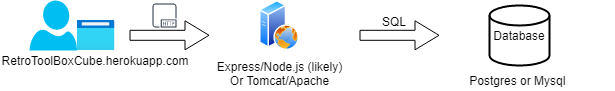
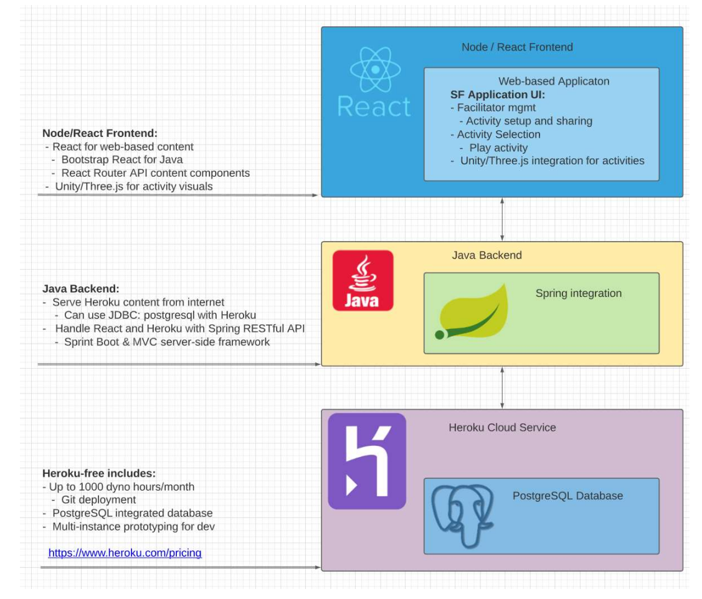

# Team 18's notes for Networking.

## Sergio

- **AWS** would be a deployment platform for docker containers. This optionw ould require a lot of setup and configuration. It would mean we have a ton of flexibility. This comes in a free option for us to use for our capstone.
  
- **Firebase** can handle authentication, storage, and the application program all with itself. It contains a wealth of options to analyze and grow the project. However, a big drawback is that it is very hard to migrate from it. This would mean that our sponsor would have a difficult time moving the capstone to their proprietary systems once the project is done.

- **Heroku** is a likely the best choice for the ease of use straightforward nature. It is easy to migrate projects to and from heroku, and comes with a student option to use for the capstone. Heroku offers site hosting, with a drawback of the site required a "wake-up" period after inactivity.

  - Heroku has limited plugin support compared to other options. For our capstone, they should be sufficient as it offers MySQL, Postgres, and MongoDB support.

## Dillon

## Shane
Network flow diagram updated.  Design needed to be able to scale.  Designed a forward looking architecture to accomodate a scaling design.  For the project we will implement a scaled down version, but having the design in place will ensure that we do not introduce any one way doors that would prevent this for succeeding as it scales.

A couple of other things to consider and make decisions on

    * Will we use IP or DNS to connec to the site?
    ** Probably need to use DNS because we are hosting in the cloud.  So we need to investigate if Heroku will provide a stable dynamic DNS name for us to use as the landing page.
    ***Update from heroku
        > By default, a Heroku app is available at its Heroku domain, which has the form [name of app].herokuapp.com. For example, an app named serene-example-4269 is hosted at serene-example-4269.herokuapp.com.> 

Network Connectivity Diagram Created and Updated

    

## Adam
- Potential network flow must be maintainable and scale.
   -  Heroku service for app hosting and database (Postgres, included, but can use other database if necessary).
      -  Heroku can scale app automatically as needed.  Can be adjusted in configuration of app service on website.  
         -  assuming we build it correctly.
   -  potential high-level design:
   

## Chris
**Breif:** Both Heroku and Firebase are excellent options for our project. For hosting and scaling, both will accomplish what we need them to. Firebase has a slight edge however as it also has other features which can be implemented into our development cycle such as authentication, a realtime database, and storage. Heroku also has a free database option using Postgre, but it has a connection limit of 20 which may or may not be an issue. It also lacks the authentification and file storage of Firebase, though this can be supplmented using a S3 bucket and using Auth0 or an in-house, basic auth solution for authentification.

**Conclusion:** Between all the options, I would recommend having Heroku for our host, an S3 bucket for asset storage which would then use Cloudfront as the CDN, Auth0 for authentification, and useing the Heroku postre database solution. If the limitations of the Heroku database become too limiting, it can be exported and setup in-house at State Farm or with another provider.
