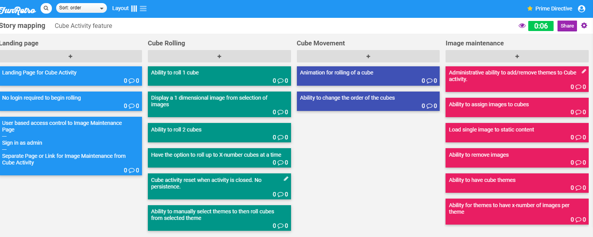

# Proof of Concept

## Link to Google Drive Document

<https://docs.google.com/document/d/1kf_w6APINSW6oJW9NumhcHprSIrlgKjEF4zqvafbWGk/edit?usp=sharing>

**Excerpt:**
Proof of Concept: Retrospective Toolkit Research Spikes

## Introduction

Over the course of our sponsor meetings,  we have initiated research spikes into our sprints to further understand and define design aspects for authentication pieces, networking requirements, and web interfaces surrounding the development of the Retrospective Toolkit (the “Toolkit”).  The underlying research allowed us to drill down design aspects, specifically which tools to use for frontend development, backend development, database management, and cloud-service hosting for the development of the Toolkit.

## Goals

The purpose of this project is to provide a viable training tool for State Farm in the form of a web application.  This will be done using a dynamic frontend framework for the client-facing web application, basic authentication to segregate facilitators from users of the Toolkit, a backend framework suitable for State Farm, as well as temporary cloud-hosting and database management.  Upon completion of the project, it is expected that State Farm will integrate the Toolkit into their own hosting and database management services.

The purpose of this proof of concept is to display aspects of knowledge the team has gained from the research spike stories conducted during the sprint.

## Testing

This section describes testing aspects of the product in three areas:  frontend, backend, and cloud-hosting and database.  Each area overlaps with each other to ensure vertical development:

- Simple landing page for frontend with Node/React.js
  - Test communication with backend
    - Test communication with database, through backend
    - Test build on localhost
    - Test build on cloud-host

- Simple Java backend
  - Test communication with frontend
  - Pass artifact information to frontend, test result.
  - Receive artifact information from frontend, test result.
    - Test communication with database
      - Pass artifact information to store in the database, evaluate the result.
        - Retrieve artifact information from the database, evaluate the result.
    - Test communication with hosting service
      - Test push to cloud-hosting service
        - Test hosting service locally
        - Test hosting service via http hosting url
    - Set up Cloud-hosting service and database
      - Test connection to backend via Spring
        - Test push update to hosting service
        - Test storage with artifact information in database storage
        - Test retrieve artifact information from database storage

## Timeline:

The timeline for development of the Toolkit will be broken down into Sprint goals.  

- Current Sprint
  - Research spikes and determine best use-case for tools
  - Provide basic prototype of web application software
    - Functional frontend, backend, cloud-hosting service and database
  - Present proof of concept to sponsors
- Next Sprint
  - Create landing page for application
    - Contain basic functional aspects of the system from UX design
    - Contain basic functional headers for landing page
    - Contain access point to the first activity to be create: Cube Activity
      - Cube to contains sample theme and images
      - Ability to roll at least one cube

## Implementation

As defined through the sponsor meetings, the project research spikes will contain four areas of technical components: web interfaces (frontend), networking requirements (split into backend, and cloud-hosting/database), and authentication pieces.. These will be implemented as follows:

__Technical Aspects and Tools: Frontend__
The User Experience will be defined via the web interface.  As mentioned above, this proof of concept revolves around the technical knowledge aspects gained from the research spikes from the current sprint, so detailed features of the product are omitted. The frontend will be comprised of:

- Utilization of React.js, based on Node.js framework.
  - Ability to handle dynamic client-side components and interactions
    - Includes animation
    - Includes page routing without browser refresh
    - Extensive library list to enhance product and UX
- Easy to modularize and maintain components for scalability.

Tools to be utilized include, but are not limited to:

- Node package Manager
- Yarn packaging
- Babelrc syntax conversion
- Webpack.j

__Technical Aspects and Tools: Backend__
Per sponsor discussion, State Farm maintains a Java-based backend framework for their products and applications.  The Toolkit project will do the same.  The backend will be comprised of:

- Utilization of Java backend, incorporating Spring for RESTful web applications
- Mature backend framework with ability to maintain and scale the application as necessary.
- Integrates easily with various build tools.
- Apache Tomcat service included with Spring for easy implementation of page service and web sockets
- JDBC utilization for database interaction

Tools to be utilized include, but are not limited to:

- Gradle build tool
- Spring Boot plugins (start, activemq, web, tomcat, data-jpa, webmvc, devtools)
- Spring Web MVC
- JUnit testing

__Technical Aspects and Tools: Cloud-hosting and Database__
After receiving input from the sponsor and with the understanding that State Farm will eventually absorb the Toolkit into their own hosting and database system, the team has decided to host the application on Heroku, and free hosting service, and utilize their free database hosting with Postgresql.

__Technical Aspects and Tools: Authentification__
The Toolkit will utilize basic authentication for its web application.  Much like the cloud-hosting section above, State Farm will eventually integrate the Toolkit into their system that utilizes its own authentication measures.  For the purposes of the project, basic authentication will be sufficient and used primarily for facilitator management of the activities of the toolkit.

__Minimum Value Product (MVP)__
The MVP for the Toolkit includes a function web application that allows users to login through basic authentication, access the main page of the toolkit, choose between at least two activities to use, and then use the activities.  The minimum functionality the landing page and of one of the two activities, the Cube Activity, can be seen in Figure 1 below:

Figure 1: Story mapping MVP of Cube Activity

### <https://www.softwaresuggest.com/blog/proof-of-concept-in-software-development/>
